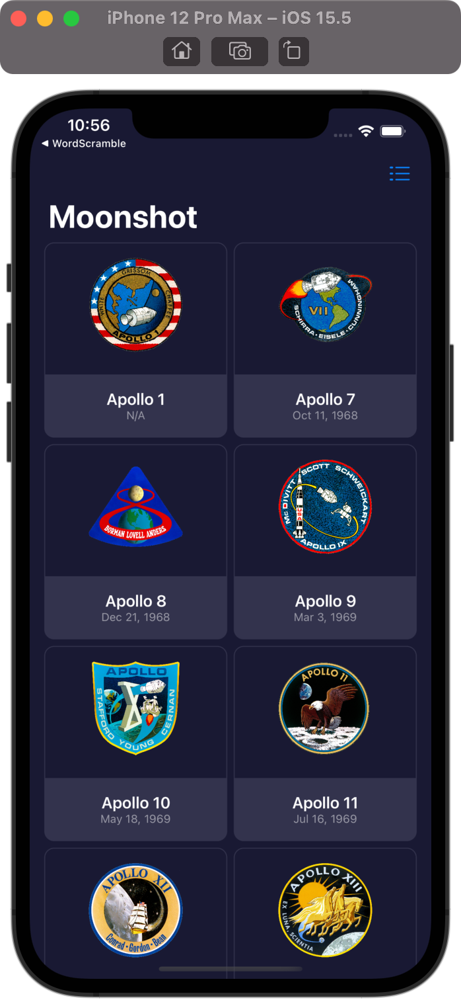
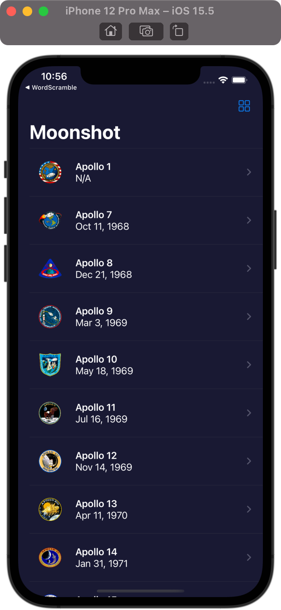
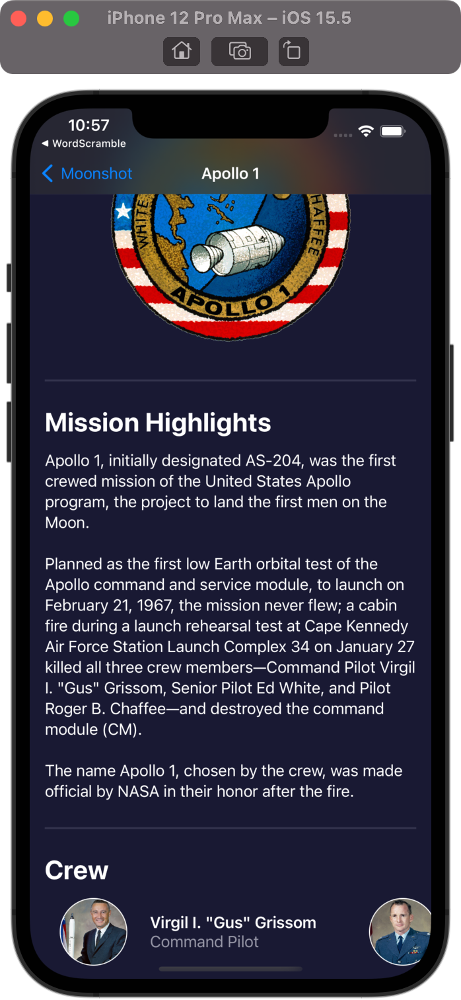
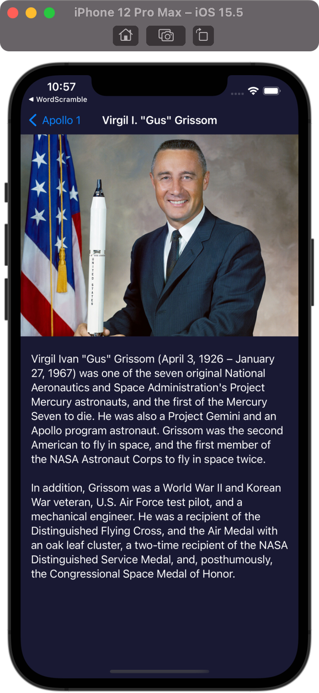

# MoonShot

## Project Description

The project is a part of 100 Days of SwiftUI curriculum by Paul Hudson [Hacking with swift](https://www.hackingwithswift.com/100/swiftui)

That app lets users learn about the missions and astronauts that formed NASA’s Apollo space program.

## Project Screen

 
 

